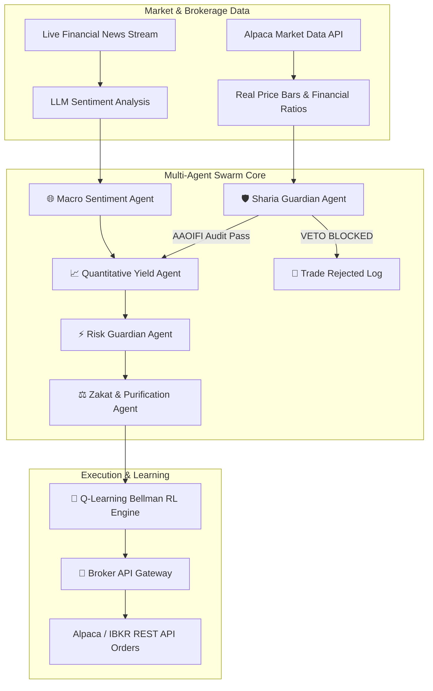

# Al-Mizan AI (الميزان) — Autonomous Sharia-Compliant Multi-Agent Wealth Manager

[](https://aaoifi.com)
[](#sharia-compliance-framework)
[](#sharia-compliance-framework)
[](#reinforcement-learning-brain)
[](LICENSE)

> **Al-Mizan AI (The Balance)** is an open-source, autonomous multi-agent wealth management platform designed to automate investment and portfolio growth with strict adherence to Islamic finance principles (AAOIFI standards).
>
> It operates with **6 specialized autonomous AI agents** running simultaneously to research, screen, execute spot trades via brokerage APIs, manage risk, and audit income to guarantee **zero haram / riba contamination**.

---

## 🌟 Key Features

### 1. 🛡️ 100% Strict Sharia Compliance Framework (AAOIFI Standard 21 & 59)
- **Sector Screen**: Automated veto of conventional banking (Riba), alcohol, gambling (Maysir), pork, adult entertainment, weapons, and conventional insurance.
- **AAOIFI Financial Ratio Screening**:
  - Interest-bearing Debt / Market Cap < **33%**
  - Cash & Interest-bearing Securities / Market Cap < **33%**
  - Impermissible (Non-Halal) Revenue < **5%**
- **Automated Income Purification Vault**: Isolates any micro-fractions of non-halal dividend revenue (<5%) and routes them directly to a dedicated Charity Purification Vault.
- **Zero Leverage / Spot Orders Only**: Enforces 0% margin lending, 0x leverage, and zero short-selling (Mudarabah & Musharakah principles).

### 2. 🤖 6 Autonomous AI Swarm Agents (Running Simultaneously)
1. 🛡️ **Sharia Guardian Agent (`ShariaAgent`)**: The supreme compliance veto authority. Audits assets in real time against AAOIFI rules and blocks non-compliant trades instantly.
2. 📈 **Quantitative Yield Agent (`YieldAgent`)**: Executes Dollar-Cost Averaging (DCA), momentum breakouts in Halal equities (NVDA, AAPL, MSFT, TSLA, LLY), Sovereign Sukuk rental yield harvests, and physical spot gold rebalancing.
3. 🌐 **Macro Sentiment Agent (`MacroAgent`)**: Monitors global central bank policies, inflation prints, and earnings announcements to dynamically adjust asset weightings.
4. ⚡ **Risk Guardian Agent (`RiskAgent`)**: Enforces portfolio diversification caps (max 20% per single stock), trailing stop-losses, and drawdown protection.
5. ⚖️ **Zakat & Purification Agent (`ZakatAgent`)**: Tracks Nisab wealth thresholds ($5,840 USD gold equivalent), lunar year holding cycles (Hawl 354 days), and calculates exact Zakat payable (2.5%).
6. 🔑 **Broker Execution Gateway (`BrokerAgent`)**: Transmits approved spot trade orders via REST APIs directly to connected brokerages.

### 3. 🧠 Self-Improving Reinforcement Learning (Q-Learning Bellman Engine)
- Powered by a local **Q-Learning Policy Engine** using the Bellman Equation:
  $$Q(s, a) \leftarrow Q(s, a) + \alpha \cdot \left[ r + \gamma \max_{a'} Q(s', a') - Q(s, a) \right]$$
- Evaluates 4 Market States (`BULL_LOW_VOL`, `BULL_HIGH_VOL`, `BEAR_LOW_VOL`, `BEAR_HIGH_VOL`) across 4 Halal Actions.
- **Model Export**: Export trained `.json` policy weights for commercial SaaS deployment.

### 4. 🔑 Live Brokerage API Integration (Alpaca / IBKR / Wahed)
- **Supported Brokers**: Alpaca Securities, Interactive Brokers (IBKR), Wahed Invest, and Binance Spot / Coinbase Spot.
- **Enforced Security Guardrail**: **Read & Trade API Access Only**. Withdrawal permissions are strictly **disabled** — funds can NEVER leave your broker account.

### 5. 📰 Live News & Optional LLM Sentiment Analysis
- Streams live Wall Street news headlines directly via Alpaca News API.
- **Optional LLM Integration**: Connect OpenAI (GPT-4o), Google Gemini (1.5 Pro), or DeepSeek (R1) API keys for automated news headline sentiment scoring.
- *Includes a built-in free Local Algorithmic Sentiment Lexicon if no LLM key is provided.*

---

## 📐 System Architecture



---

## 🚀 Quick Start & Installation

### Prerequisites
- [Node.js](https://nodejs.org/) v18.0 or higher
- `npm` or `pnpm`
- *(Optional)* An [Alpaca Securities Account](https://alpaca.markets) (Free Paper Trading API key)

### 1. Clone the Repository
```bash
git clone https://github.com/Hassankhn/AI_Portfolio_Swarm.git
cd AI_Portfolio_Swarm
```

### 2. Install Dependencies
```bash
npm install
```

### 3. Run Development Server
```bash
npm run dev
```
Open your browser and navigate to **`http://localhost:5173`**.

---

## 🔑 Broker API Key Setup

1. Click the **`Connected Broker`** (key icon) at the top right of the application header.
2. Select **Alpaca Securities** (or your preferred broker).
3. Select **`🧪 Paper Trading Sandbox`** (or Live Execution).
4. Enter your **Alpaca API Key ID** (starts with `PK...`) and **Secret Key**.
5. Click **`Test Real API Connection`** to verify live authentication against Alpaca `/v2/account`.
6. Click **`Save & Authorize Swarm`**.

> 🔒 **Security Guarantee**: All API credentials are stored 100% locally in your browser's `localStorage` or local `.env.local` file. No keys are ever uploaded to external servers.

---

## 📄 License & Community Disclaimer

Distributed under the **MIT License**. See `LICENSE` for more information.

> **Sharia Compliance Disclaimer**: All financial screening ratios implemented in Al-Mizan AI follow the Accounting and Auditing Organization for Islamic Financial Institutions (AAOIFI) Sharia Standards No. 21 (Equities) & No. 59 (Zakat). Users are encouraged to consult with certified Islamic finance scholars for personal wealth advisory.

---

### 💚 Developed with Care for the Global Muslim Ummah & Halal Investors Worldwide
If you find this project valuable, please consider giving it a ⭐ on GitHub and sharing it with brother and sisters seeking 100% Halal wealth automation!
